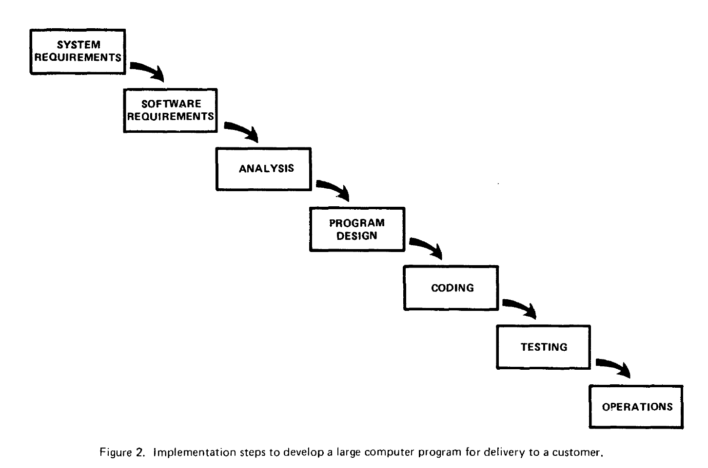

Central Connecticut State University

# Process Description

## SCRUM – Applying the Framework

By: DeAlessio, Bryce T. (Student)


## Introduction

### Technical definition

Within the scope of Project Management of software products Scrum is an iterative and empirical “framework within which people can address complex adaptive problems, while productively and creatively delivering products of the highest possible value” (Schwaber & Sutherland). This framework sets forth a set of roles for the people involved in a software development project, a series of events that occur during the process and the artifacts that flow through those events to produce a potentially deliverable portion of the overall project. It uses a number of concepts borrowed from “Lean Manufacturing Principles” <need reference (Toyota way)>.

### Purpose and function

The purpose of Scrum is to provide a project management process that can handle incomplete and or rapidly changing customer requirements. Scrum is one of a number of project management systems geared toward software and systems development that arose (Beck & others, 2001) due to backlash against the traditional “Water Fall” method. The "Water Fall" method placed heavy emphasis on knowing all customer requirements before starting a project and delivering a product to a fixed contract. See figure 1.


Figure 1 Traditional Waterfall Method (Royce)[1]

In contrast Scrum's emphasis is on maintaining close communication with the customer to handle changing requirements.

### Process Overview

At the start of a new Scrum project the Scrum team gathers initial customer requirements and Creates
a Product Backlog. Within a Scrum team there are three roles, the Product Owner, the Scrum Manger
and the developers (the people performing the actual work). With the initial team and product
backlog in place an on-going series of events take place called Sprints which end only after the
product is deemed done. Within each sprint a series of smaller events take place starting with the
Sprint Planning Meeting, Then a daily Scrum meeting to track progress. At the end of the Sprint a
Sprint Review meeting is held with both Scrum team and customers present. Finally a Sprint
Retrospective meeting is held for the team to evaluate it's execution of the Sprint.


  
Figure 2 | The Scrum Process [5]


#### Roles
lorem ipsum

### Gather Requirements
The Product Owner is the sole point of contact of the Scrum team with the customer. Thus the
Product Owner takes responsibility for gathering product requirements from the customer for a requested
product. The Product Owner works with the team to analyze the requirements and create a product
Backlog which is a collection of features of the overall product to be worked on.

### Sprint
The

```
* List the major steps of the process in the order that they will be described.

Discussion
* Step1
* Define the step
* Describe it’s purpose and function
* Describe what happens during this step
Conclusion
* Summarize the function and steps
```
Detailed Requirements:
Design & Analysis
Implementation & Developer Testing
Deployment

```
Steps:

    1) Product Owner – the Product Owner is the interface between the customer and the development
       team
    2) Scrum Manager
    3) Development Team
2) Gather Initial Customer Requirements.
    1) The Product Owner interfaces with the customer requirements for delivering a finished product
       as well as priority of which functions of the product they would like to see first.
3)	The Sprint:
4)	Create Product Backlog.
    1) The Product Backlog is the list of features to add to the product that will satisfy the
    customer’s requirements.
5)	The Sprint backlog
    1) For each sprint the scrum team decides which Product Backlog Items to work on.
6)	Sprint Planning.
7)	The Sprint.
8)	Sprint Review.
9)	Deliver
```


## Citations

[1] Beck, Kent, and Others. "Manifesto for Agile Software Development." Manifesto for Agile Software Development. N.p., 2001. Web. 04 Mar. 2017.

[2] Winston Royce, “Managing the Development of Large Software Systems”, Proceedings of IEEE WESCON 26 (August): 1–9, 1970. http://www.cs.umd.edu/class/spring2003/cmsc838p/Process/waterfall.pdf
printed from Proceedings, IEEE WESCON, August 1970, pages 1-9.
Copyright © 1970 by The Institute of Electrical and Electronics Engineers, .328
Inc. Originally published by TRW.

[3] "Learn About Scrum." What is Scrum? An Agile Framework for Completing Complex Projects - Scrum Alliance. The SCRUM Alliance, n.d. Web. 22 Feb. 2017.  
*Why Is It Called Scrum?
When Jeff Sutherland created the scrum process in 1993, he borrowed the term "scrum" from an analogy put forth in a 1986 study by Takeuchi and Nonaka, published in the Harvard Business Review. See more at: https://www.scrumalliance.org/why-scrum#sthash.GGacCoIa.dpuf*

[4] Schwaber, Ken, and Jeff Sutherland. "The Scrum Guide™." Scrum Guide | Scrum Guides. Scrumguides.org, n.d. Web. 27 Feb. 2017.
